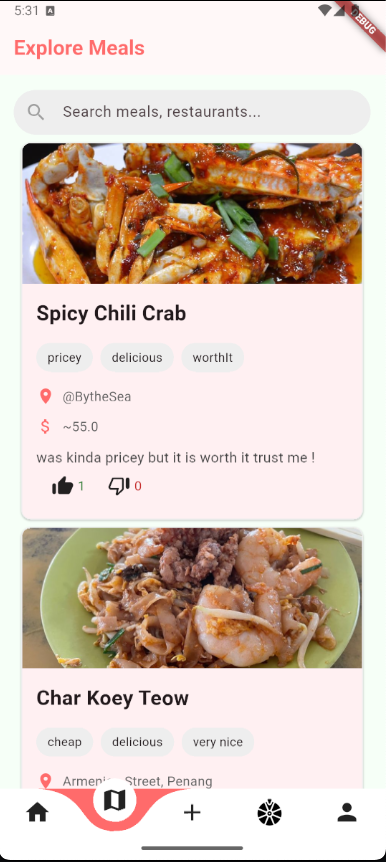
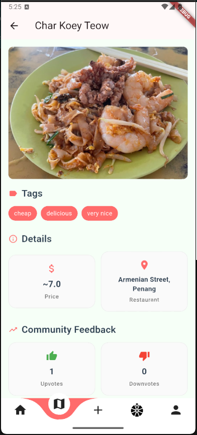
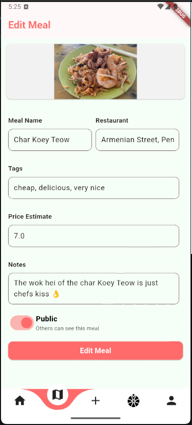
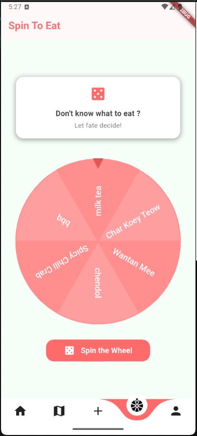
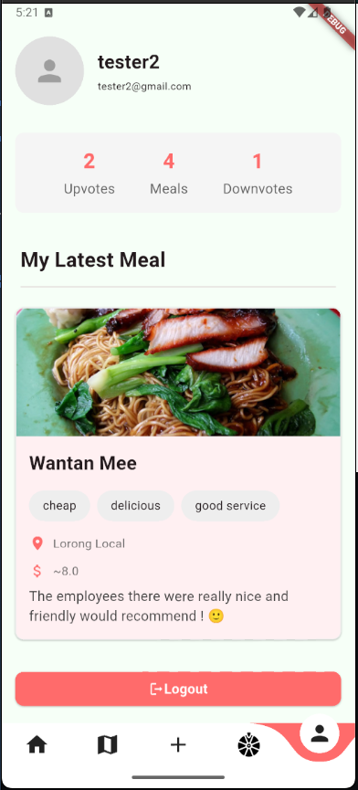
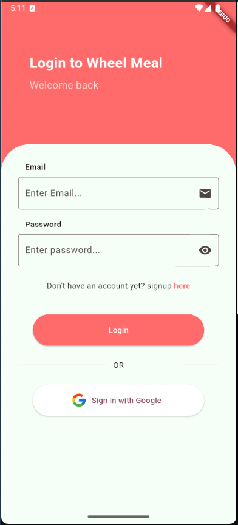

# Wheel Bites!  
*A Flutter app to help you decide what to eat and log your meals.*

## 🚀 Getting Started

This is the starting point for **Wheel Bites**, a meal-logging and food suggestion app.

To try it out:

1. Fork the repo.
2. Set up a [Supabase](https://supabase.com) account and connect it to the app.
3. In your terminal, run:
   ```bash
   flutter clean
   flutter run

### Core Features of “Wheel Bites”

🔐 **Authentication**  
• Sign in/up with Supabase Auth (email, Google)

📤 **Meal Logging**  
• Add/Edit/View meal or restaurant  
• 📷 Photo upload (Supabase Storage)  
• 🏷️ Tags (e.g., spicy, halal, vegan)  
• 📍 Location (manual)  
• 📝 Notes (review, memory, price)  
• 🔒 Public or Private visibility

👍👎 **Community Trust**  
• Browse public meals from other users  
• Vote on them:  
  • 👍 Upvote: “I trust this post”  
  • 👎 Downvote: “Not helpful/misleading”  
• Votes stored with the post

🎡 **Wheel Spin** 
• Uses `flutter_fortune_wheel`  
• Spin from user-added food/restaurants  
• Fallback to default categories if no entries exist  
• Show result and allow spin again

## 🖼️ Screenshots

| Explore/Home | Details | Edit/ADD |
|---------|---------|------|
|  |  |  |

| Fortune Wheel | Profile | Auth |
|---------------|---------|------|
|  |  |  |

---

A few resources to get you started with Flutter:

- [Lab: Write your first Flutter app](https://docs.flutter.dev/get-started/codelab)  
- [Cookbook: Useful Flutter samples](https://docs.flutter.dev/cookbook)  
- [Flutter documentation](https://docs.flutter.dev/) for tutorials, samples, and API reference
